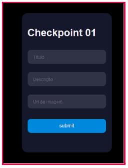
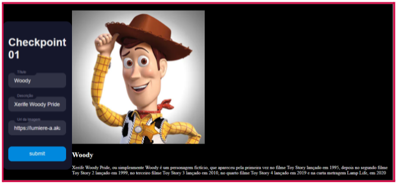

# Checkpoint 1 - Front End 2

## Instruções e requisitos do entregável

    1. O tema da aplicação é de sua preferência. Pode ser sobre carros, animes, cidades, etc.
    2. A aplicação deve ser responsiva.
    3. A aplicação consiste em um formulário que, ao ser preenchido, cria cards com as informações preenchidas.
    4. Sobre o formulário: 
    a. O formulário deve ter pelo menos 4 campos: Título, Descrição e URL da imagem e um botão de submit.
    b. Após o preenchimento, ao clicar no botão de submit, as informações devem ser adicionadas à lista de cards na página.
    ➔ Dica
        ◆ Você pode acrescentar outros campos ao formulário para deixar a aplicação mais completa.
    5. Sobre os Cards:
        a. Os cards devem ter uma imagem e constar todas as informações previamente preenchidas no formulário. 
        b. O comportamento se dará de forma que as informações preenchidas sejam exibidas na seção de cards.

## Exemplos conceituais

    1. Exemplo de Formulário

    2. Exemplo de Card

### Grupo 14

#### Membros 

Cristian Daniel Fernandes 
Danielle Alves 
Gabriel Rizzo

